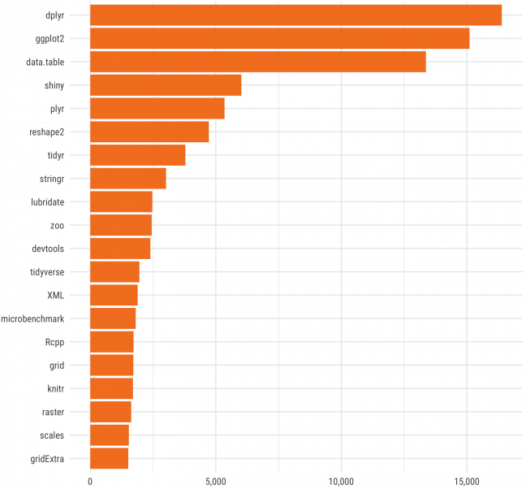

# 📖 أساسیات لغة البرمجة الإحصائیة (آر)

## 📌 عن الكتاب

**أساسیات لغة البرمجة الإحصائیة (آر)
(مدخل لتحلیل البیانات الز ا رعیة والبیئیة)**     إن أﺻدار ﻫذا اﻟﻛﺗﺎب )ﻛﺧطوة أوﻟﻰ( ﻧﺎﺗﺞ ﻋن اﻟﺣﺎﺟﺔ اﻟﻣﺎﺳﺔ ﻟﺳد اﻟﻔﺟوة اﻟﻣوﺟودة ﻓﻲ اﻟﻠﻐﺎت اﻹﺣﺻﺎﺋﯾﺔ ﻓﻲ اﻟﻣﻧﺎﻫﺞ اﻟﻌرﺑﯾﺔ.  ﻓﻣن اﻟﻣﻬم ﺟداً ﻋﻧد اﻟوﻟوج إﻟﻰ ﻋﻠم اﻹﺣﺻﺎء ﻣن أﺟل اﻟﺗﺣﺎﻟﯾل   اﻹﺣﺻﺎﺋﯾﺔ ﻟﻠﺗﺟﺎرب اﻟﻣﯾداﻧﯾﺔ أن ﯾﺗم ﻓﻬم ﻋﻣل اﻟﻣﻌﺎدﻻت اﻹﺣﺻﺎﺋﯾﺔ وﻛﯾﻔﯾﺔ ﻣﻌﺎﻟﺟﺔ اﻟﺑﯾﺎﻧﺎت ﻛﺧطوة أوﻟﻰ ﻟﻣﺧرﺟﺎت رﺻﯾﻧﺔ. إذ ﯾدرس ﻓﻲ أﻏﻠب اﻟﺟﺎﻣﻌﺎت واﻟﻣﻌﺎﻫد ﻋﻠم اﻹﺣﺻﺎء ﻛﺄﺣد اﻟطرق اﻟﻌﻠﻣﯾﺔ ﻟﺟﻣﻊ  اﻟﺑﯾﺎﻧﺎت وﺗﻧظﯾﻣﻬﺎ وﺗﺣﻠﯾﻠﻬﺎ ﻟﻠوﺻول إﻟﻰ ﻧﺗﺎﺋﺞ ﻣوﺛوﻗﺔ ﺗﺳﻬم ﻓﻲ دﻋم اﻟﻘ ار ارت اﻟﻣﺳﺗﻘﺑﻠﯾﺔ. وان اﺗﺳﺎع إﺳﺗﺧدام ﻋﻠم اﻹﺣﺻﺎء ﻧﺎﺗﺞ ﻋن اﻟﺗطو ارت اﻟﺳرﯾﻌﺔ ﻓﻲ اﻟﻌﻠوم اﻟﻣﺧﺗﻠﻔﺔ وﻛﻣﯾﺔ اﻟﺑﯾﺎﻧﺎت اﻟﻌﻣﻼﻗﺔ اﻟﺗﻲ ﻣن اﻟﻣﻣﻛن اﻟﺣﺻول ﻋﻠﯾﻬﺎ ﻓﻲ زﻣن وﺟﻬد ﻗﯾﺎﺳﯾﯾن. ﻫذا اﻹﺗﺳﺎع ﻛﺎن ﻻﺑد أن ﯾؤدي إﻟﻰ ﺗﺣﻔﯾز اﻟﻣﺧﺗﺻﯾن ﻋﻠﻰ إﻧﺷﺎء أو ﺗﺑﻧﻲ ﺑﻌض اﻷدوات اﻟﺗﻲ ﺗُﺳﻬم ﻓﻲ ﺗﺳﻬﯾل ﻋﻣﻠﯾﺔ اﻟﺗﻧظﯾم واﻟﺗﺣﻠﯾل وﻏﯾرﻫﺎ ﻟﻠﻧﺗﺎﺋﺞ. ﻋﻠﻰ أﺛر ذﻟك اﻧﺗﺷرت اﻟﺑ ارﻣﺞ اﻹﺣﺻﺎﺋﯾﺔ اﻟﻣﺧﺗﻠﻔﺔ, ﻓﻘد أﺻﺑﺣت اﻟﺑ ارﻣﺞ اﻹﺣﺻﺎﺋﯾﺔ أﻛﺛر ﺗداوﻻً ﺑل ﺗُدرس ﻓﻲ ﻣﺧﺗﻠف اﻟﻣﻌﺎﻫد واﻟﺟﺎﻣﻌﺎت اﻟﻣﻧﺗﺷرة وﻓﻲ ﺗطﺑﯾﻘﺎت اﻷﻋﻣﺎل اﻟﻬﺎﻣﺔ ، وﻫذا ﻣﺎ ﻧﻠﻣﺳﻪ واﺿﺣﺎ ﻓﻲ ﺗدرﯾس ﺑرﻧﺎﻣﺞ ﻣﻌﺎﻟﺞ اﻟﺟداول Excel واﻟﺑرﻧﺎﻣﺞ اﻹﺣﺻﺎﺋﻲ SPSS وﺑرﻧﺎﻣﺞ Matlab و Minitab وﺑرﻧﺎﻣﺞ SAS و S. 

- *ﺗُﻌد ﻟﻐﺔ ال R أﺣدى ﻟﻐﺎت اﻟﺑرﻣﺟﺔ ﻣﻔﺗوﺣﺔ اﻟﻣﺻدر وﻫذا ﯾﻌﻧﻲ أﻧﻪ ﯾﻣﻛن ﻷي ﺷﺧص اﻟﻌﻣل ﻣﻊ
ﻟﻐﺔ الR دون اﻟﺣﺎﺟﺔ إﻟﻰ ﺗرﺧﯾص أو رﺳوم. ﻋﻼوة ﻋﻠﻰ ذﻟك, ﯾﻣﻛﻧك اﻟﻣﺳﺎﻫﻣﺔ ﻓﻲ ﺗطوﯾر ﻟﻐﺔ الR ﻣن
ﺧﻼل ﺗﻌدﯾل اﻟﺣزم اﻟﻘدﯾﻣﺔ وﺗطوﯾر ﺣزم ﺟدﯾدة واﯾﺟﺎد ﺣل ﻟﺑﻌض اﻟﻣﺷﺎﻛل ﻓﻲ اﻟﺗﺧﺻﺻﺎت اﻟﻣﺧﺗﻠﻔﺔ.*
- *ﺗوﻓر ﻟﻐﺔ ال R دﻋﻣﺎً ﻣﺛﺎﻟﯾﺎً ﻟﻠﺑﯾﺎﻧﺎت اﻟﺟدﻟﯾﺔ )ﺑﻣﻌﻧﻰ اﻟﺑﯾﺎﻧﺎت ﺷدﯾدة اﻟﻔوﺿوﯾﺔ,( ﻫذا اﻟدﻋم ﻣﺗﻣﺛل ﺑوﺟود ﺣزم ﻣﺛل ال dplyr و readr واﻟﺗﻲ ﺗﻌﻣل ﻋﻠﻰ ﺗﺣﺳﯾن اﻟﺑﯾﺎﻧﺎت اﻟﻔوﺿوﯾﺔ وﺗﺣوﯾﻠﻬﺎ إﻟﻰ ﺑﯾﺎﻧﺎت ﻧﻣوذﺟﯾﺔ ﻣﻘروءة ﺑﺷﻛل ﺟﯾد ﻣن ﻗﺑل اﻟﺑﺎﺣﺛﯾن واﻟطﻼب واﻟﻣﻬﺗﻣﯾن ﺑﻬذﻩ اﻟﺑﯾﺎﻧﺎت.*
- *ﻟدى ﻟﻐﺔ الR ﻣﺟﻣوﻋﺔ ﻛﺑﯾرة ﻣن اﻟﺣزم اﻟﻣﺗﻧوﻋﺔ. ﯾوﺟد أﻛﺛر ﻣن (10,000) ﺣزﻣﺔ ﻓﻲ ﻣﺳﺗودع)ﺷﺑﻛﺔ ارﺷﯾف ال آر اﻟﺷﺎﻣﻠﺔ( Network Archive R Comprehensive واﻟﺗﻲ ﺗُﻛﺗب إﺧﺗﺻﺎ ار ,CRAN ﻋﻠﻣﺎ أن ﻫذا اﻟﻌدد ﯾﺗ ازﯾد ﺑﺎﺳﺗﻣ ارر. ﻫذﻩ اﻟﺣزم ﻣﺗﻧوﻋﺔ ﻓﻲ طﺑﯾﻌﺔ ﻋﻣﻠﻬﺎ ﻓﻬﻲ ﻣﺗداﺧﻠﺔ ﺑﯾن اﻟﻌﻠوم اﻟﻣﺧﺗﻠﻔﺔ وأﯾﺿﺎً ﻣﺗﺧﺻﺻﺔ ﺑﻌض اﻟﻌﻠوم اﻻﺧرى. ﺗﺧﺗﻠف اﻟﺣزم ﻣن ﻧﺎﺣﯾﺔ اﻻﻗﺑﺎل ﻋﻠﯾﻬﺎ, ﻓﺑﻌض اﻟﺣزم ﺗﻛون ذات اﻗﺑﺎل اوﺳﻊ ﻣن ﻏﯾرﻫﺎ. ﯾﻌﺗﻣد اﻹﻗﺑﺎل إﻟﻰ أﻫﻣﯾﺔ اﻟﺣزﻣﺔ وﻣﺎ ﺗﺣﺗوﯾﻪ ﻣن دوال داﺧﻠﯾﺔ وﻛذﻟك إﻟﻰ ﻛﯾﻔﯾﺔ اﻟﺗﻌﺎﻣل ﻣﻊ اﻟﺑﯾﺎﻧﺎت وﻣﺧرﺟﺎﺗﻬﺎ.
اﻟﺷﻛل اﻵﺗﻲ ﯾوﺿﺢ أﻛﺛر اﻟﺣزم إﻗﺑﺎﻻ ﻣن ﻗﺑل اﻟﻣﺳﺗﺧدﻣﯾن ﺣﺗﻰ ﻋﺎم 2017 .[Ove]*

هذا الكتاب موجه إلى:
- *الطلاب الجامعيين من الدراسات الاولية والعليا*
- *المهتمين في التطور البرمجي و الهواة*

---

## 📥 تحميل أو قراءة الكتاب

يمكنك قراءة أو تحميل الكتاب من هنا:

📄 **PDF:** [رابط ملف الـ PDF]  
📚 **eBook:** [رابط النسخة ePub / MOBI إن وجدت]  

---

## 🧠 ماذا ستتعلم

في هذا الكتاب ستتعرف على:
1. **الفصل 1 – *البداية مع ال R***  
   *  ﻟﻐﺔ ﺑرﻣﺟﺔ ال R ﻣن اﻟﻠﻐﺎت اﻷﻛﺛر اﻧﺗﺷﺎرا ﺣول اﻟﻌﺎﻟم ﻟﻣﺎ ﺗﺣﺗوﯾﻪ ﻫذﻩ اﻟﻠﻐﺔ ﻣن اﻣﻛﺎﻧﯾﺎت ﻋﺎﻟﯾﺔ ﻓﻲ ﻛل ﻣن اﻟﺗﺣﻠﯾل اﻹﺣﺻﺎﺋﻲ Analysis ,Statistical اﻟرﺳوﻣﺎت اﻟﺑﯾﺎﻧﯾﺔ Graphics واﻟﺗﻘﺎرﯾر اﻟدورﯾﺔ. اﻟﺗﺻﺎﻋد اﻟﻣﺳﺗﻣر ﻓﻲ ﻋدد اﻟﻣﺳﺗﺧدﻣﯾن ﻟﻠﻐﺔ اﻟﺑرﻣﺟﺔ اﻹﺣﺻﺎﺋﯾﺔ ال R ﻋﻠﻰ ﻣﺳﺗوى اﻟﻌﺎﻟم اﺛﺑت ﻓﺎﺋدة اﻟﻠﻐﺔ ﻋﻠﻰ اﻟﻣﺳﺗوﯾﯾن )اﻟﺗطﺑﯾﻘﻲ, واﻻﻛﺎدﯾﻣﻲ( ﻓﻲ ﺗﺣﻠﯾل ﻋرض ﻣﺧﺗﻠف اﻟﺑﯾﺎﻧﺎت وﺗﻔﺳﯾرﻫﺎ ﺑﻣﺎ ﯾﺳﻬم ﻓﻲ ﺗﺣدﯾد اﻟﻘ ارر اﻟﻧﻬﺎﺋﻲ.*

2. **الفصل 2 – *بيئة ال R**  
   *ﻫﻧﺎك اﻟﻌدﯾد ﻣن اﻟﺑﯾﺋﺎت اﻟﻣﺗطورة اﻟﻛﺎﻣﻠﺔ Environment Development Integrated واﻟﺗﻲ ﺗﺳﻣﻰ أﺧﺗﺻﺎ ار IDEs اﻟﺗﻲ ﻋﻣﻠت ﺧﺻﯾﺻﺎ ﻟﻠﺗﻌﺎﻣل ﻣﻊ ﻟﻐﺔ ال آر ﻣوﺟودة ﻓﻲ اﻟﺷﺑﻛﺔ اﻟﻌﻧﻛﺑوﺗﯾﺔ ﻣﻊ ذﻟك ﯾﻧﺻﺢ ﺑﺎﻟﺗﻌﺎﻣل ﻣﻊ ﺑرﻧﺎﻣﺞ ال RStudio ﻛوﻧﻪ ﻣن أﻓﺿل اﻟﺑ ارﻣﺞ اﻟﻣﻌدة ﻟﻠﺗﻌﺎﻣل ﻣﻊ ﻟﻐﺔ الآر.*

3. **الفصل 3 – *حزم ال R***  
   *ﻣن أﻫم ﻣﺻﺎدر اﻟﻘوة واﻟرﻏﺑﺔ ﻓﻲ اﻟﻌﻣل ﺑﺑرﻣﺟﺔ ال R ﻫﻲ وﺟود اﻟﺣزم اﻟﺗﻲ ﻣن اﻟﻣﻣﻛن ﻣﺷﺎرﻛﺗﻬﺎ ﻣﻊ اﻟﺟﻣﯾﻊ دون اﺳﺗﺛﻧﺎء. ﺣﺗﻰ ﻣﻧﺗﺻف ﻋﺎم ,2017 ﻛﺎن ﻫﻧﺎك ﻣﺎ ﯾﻘﺎرب ﻣن (10,000) ﺣزﻣﺔ ﻣﺗﺎﺣﺔ ﻋﻠﻰ ﻣوﻗﻊ ,CRNA ﻛﺗﺑت ﻣن ﻗﺑل أﻛﺛر ﻣن (2000) ﺷﺧص. ﻟﯾس ﻓﻘط اﻟﻌدد اﻟﻛﺑﯾر ﻣن اﻟﺣزم اﻟﻣﺗوﻓرة واﻟﻣﺗﺎﺣﺔ ﻟﻠﺟﻣﯾﻊ ﻣﺎ ﯾﺛﯾر اﻻﻫﺗﻣﺎم ﻓﻘط, وأﻧﻣﺎ ﻫﻧﺎك اﻟﻌدﯾد ﻣن اﻟﺷﺧﺻﯾﺎت اﻻﻛﺎدﯾﻣﯾﺔ اﻟ ارﺋﻌﺔ اﻟﺗﻲ
أﺳﻬﻣت ﻓﻲ إﺛ ارء اﻟﺣزم وﻛﺗﺑت ﺑﻌض ﻣﻧﻬﺎ ﻧذﻛر ﻣﻧﻬم Wickham) Hadley and Eddelbuettel Dirk , Hastie Trevor , Gelman .(Andrew اﻟﺣزﻣﺔ ﻋﺑﺎرة ﻋن ﻣﻛﺗﺑﺔ ﺗﺣﺗوي اﻟﻌدﯾد ﻣن اﻟﻛودات اﻟﺗﻲ ﺗﻘوم ﺑﻣﻬﻣﺔ ﻣﻌﯾﻧﺔ أو اﻟﻌدﯾد ﻣن اﻟﻣﻬﺎم.
*

4. **الفصل 4 – *أساسيات ال R***  
   *ﻓﻲ ﻫذا اﻟﻔﺻل ﺳﯾﺗم اﻟﺗﻌرف ﻋﻠﻰ اﻧواع اﻟﺑﯾﺎﻧﺎت اﻟﺗﻲ ﯾﺗﻌﺎﻣل ﻣﻌﻬﺎ ال R وﻛذﻟك ﺗرﻛﯾب اﻟﺑﯾﺎﻧﺎت. ﻟﺗﺣﻘﯾق أﻗﺻﻰ اﺳﺗﻔﺎدة ﻣن ﻟﻐﺔ R, ﺳﺗﺣﺗﺎج إﻟﻰ ﻓﻬم ﻗوي ﻷﻧواع اﻟﺑﯾﺎﻧﺎت اﻷﺳﺎﺳﯾﺔ وﻫﯾﺎﻛل اﻟﺑﯾﺎﻧﺎت وﻛﯾﻔﯾﺔ
اﻟﻌﻣل ﻋﻠﯾﻬﺎ. ﻣن اﻟﻣﻬم ﺟًدا ﻓﻬم ﻫﯾﺎﻛل اﻟﺑﯾﺎﻧﺎت ﻧظ ار ﻟﻠﺣﺎﺟﺔ إﻟﻰ اﻟﺗﻌﺎﻣل ﻣﻌﻬﺎ ﺑﺷﻛل ﯾوﻣﻲ ﻓﻲ ال .R ﻛﻣﺎ وان ﻣن اﺣد اﻷﻣور اﻟﻬﺎﻣﺔ ﻫﻲ ﻫﻲ ﺗﺣوﯾل اﻧواع وﺗ ارﻛﯾب اﻟﺑﯾﺎﻧﺎت ﻓﯾﻣﺎ ﺑﯾﻧﻬﺎ, ﻫذا اﻟﺗﺣوﯾل ﯾﻌد أﺣد
أﻛﺛر ﻣﺻﺎدر اﻹﺣﺑﺎط ﺷﯾوعا ﻟﻠﻣﺑﺗدﺋﯾن.
*

5. **الفصل 5 – *المشغلات في ال R**  
   *اﻟﻣﺷﻐل ﻫو رﻣز ﯾﺧﺑر ﻟﻐﺔ ال آر ﺑﻌﻣل ﻣﻌﺎﻟﺟﺎت رﯾﺎﺿﯾﺔ أو ﻣﻧطﻘﯾﺔ ﻣﺣددة.  ﻟﻐﺔ R ﻏﻧﯾﺔ
ﺑﺎﻟﻣﺷﻐﻼت اﻟﻣﺧﺗﻠﻔﺔ اﻟﺗﻲ ﺗﻛون اﻣﺎ ﻣوﺟودة ﺑﺷﻛل أﺳﺎﺳﻲ ﻣﻊ ال R أو ﻣﺗوﻓرة ﻣن ﺧﻼل اﻟﺣزم. ﻓﻬم ﻋﻣل اﻟﻣﺷﻐﻼت ﯾﺳﻬم ﻓﻲ ﺗذﻟﯾل اﻟﻛﺛﯾر ﻣن اﻟﺗﻌﻘﯾدات اﻟﻣ ارﻓﻘﺔ ﻟﻌﻣل اﻟﻛود. ﻓﻲ اﻟﻐﺎﻟب اﺳﺗﺧدام اﻟﻣﺷﻐل ﺑﺎﻟﺻورة اﻟﺻﺣﯾﺣﺔ ﯾﻘﻧن اﻟﻬدر ﻓﻲ اﻟوﻗت واﻟدﻗﺔ ﺑﺎﻟﻧﺗﺎﺋﺞ. ﺗوﻓر ﻟﻐﺔ ال R اﻧواع ﻣﺧﺗﻠﻔﺔ ﻣن اﻟﻣﺷﻐﻼت ﻣﻧﻬﺎ ﻣﺎﻫو ﺣﺳﺎﺑﻲ, ﺗ ارﺑطﻲ, ﻣﻧطﻘﻲ, ﺗﺧﺻﺻﻲ, ﻣﺗﻧوﻋﺔ وﻣﺷﻐﻼت اﻟﻌﺑور. ﺗﺗ اروح اﻟﻣﺷﻐﻼت ﻣن اﻟﺑﺳﯾط
ﻣﺛل ﻋﻣﻼت اﻟﺟﻣﻊ واﻟطرح إﻟﻰ ﻣﺎﻫو ﻣﻘﺗرن ﺑﺎﻟﻌﻣﻠﯾﺎت اﻟﺣﺳﺎﺑﯾﺔ ﻟﻠﻣﺻﻔوﻓﺎت ﻣﺛﻼ.
*

6. **الفصل 6 – *قراءة البيانات ***  
   *ﻓﻲ اﺣﯾﺎن ﻛﺛﯾرة ﯾﺗم اﻟﺗﻌﺎﻣل ﻣﻊ ﺑﯾﺎﻧﺎت ﻛﺑﯾرة ﻣﺧزوﻧﺔ ﻓﻲ أﺣد اﻟﻣواﻗﻊ أو ﻓﻲ ﺟﻬﺎز اﻟﺣﺎﺳوب. ﻋﻣﻠﯾﺔ ادﺧﺎﻟﻬﺎ ﻋن طرﯾق ﻛﺗﺎﺑﺗﻬﺎ أﻣر ﺷﺑﻪ ﻣﺳﺗﺣﯾل ﻟﻛﻣﯾﺗﻬﺎ اﻟﻛﺑﯾرة ﻟذﻟك ﯾوﻓر ال R اﻣﻛﺎﻧﯾﺔ ﻗ ارءة ﻫذﻩ اﻟﺑﯾﺎﻧﺎت وﻋرﺿﻬﺎ ﻓﻲ ﻓﺿﺎء اﻟﻌﻣل وﻣن ﺛم اﺟ ارء اﻟﺗﻌدﯾﻼت واﻟﻌﻣﻠﯾﺎت اﻟﺣﺳﺎﺑﯾﺔ ﻋﻠﯾﻬﺎ. وﻣن اﻟﻣﻣﻛن أﯾﺿﺎً اﻋﺎدة ﺧزﻧﻬﺎ ﺑﻌد اﻷﺿﺎﻓﺔ, اﻟﺗﻌدﯾل أو اﻟﺣذف ﻓﯾﺄي ﻣﻛﺎن ﻓﻲ اﻟﺣﺎﺳوب ﺑﺎﻟﺻﯾﻐﺔ اﻟﻣﻧﺎﺳﺑﺔ ﻟﺣﻔظ اﻟﺑﯾﺎﻧﺎت. ﺗﻌدد اﻟﺻﯾﻎ اﻟﺗﻲ ﺗﺣﻔظ ﺑﻬﺎ اﻟﺑﯾﺎﻧﺎت ﺟﻌﻠت ﻋﻣﻠﯾﺔ ﻣﻌﺎﻟﺟﺔ اﻟﺑﯾﺎﻧﺎت ﺗﻣر ﻋﺑر ﻋدة ﺧطوات ﺑﻧﺎء ﻋﻠﻰ اﻟﺻﯾﻐﺔ اﻟﻣﺣﻔوظﺔ ﺑﻬﺎ اﻟﺑﯾﺎﻧﺎت ﻛﺄن ﺗﻛون ,Excel  ,CSV XML ... اﻟﺦ. ﻓﻲ ﻫذا اﻟﻔﺻل ﺳﯾﺗم ﻋرض
اﻟﺻﯾﻎ أﻏﻠب اﻟﺻﯾﻎ اﻟﻣﺳﺗﺧدﻣﺔ ﻓﻲ ﺣﻔظ اﻟﺑﯾﺎﻧﺎت وﻛﯾﻔﯾﺔ اﻟﺗﻌﺎﻣل ﻣﻌﻬﺎ ﺑﻣﺎ ﯾﺧدم ﻣﺣﻠل اﻟﺑﯾﺎﻧﺎت.*

7. **الفصل 7 – *رسومات أحصائية ***  
   *ﻣن أﻫم اﻷﻣور وأﺻﻌﺑﻬﺎ ﻧوﻋﺎً ﻣﺎ ﻫو دﻋم اﻟﻧﺗﺎﺋﺞ ﺑرﺳوﻣﺎت ﺗوﺿﯾﺣﯾﺔ ﺗﻌﻣل ﻋﻠﻰ اﯾﺻﺎل اﻟﻔﻛرة ﻣن اﻷرﻗﺎم إﻟﻰ اﻟﻣﺗﻘﻠﻲ ﺑﺻورة ﺟﯾدة. ﻓﻌﻠﻰ ﺳﺑﯾل اﻟﻣﺛﺎل, اﻟرﺳوﻣﺎت اﻟﺗوﺿﯾﺣﯾﺔ ﺗﻌﻣل ﻋﻠﻰ اﻋطﺎء ﻗﯾﻣﺔ
ﻓﻌﻠﯾﺔ ﻟﻠﻧﺗﺎﺋﺞ ﻓﺎﻟرﺳم اﻟﺟﯾد ﯾﻌﻣل ﻋﻠﻰ رﻓﻊ اﻟﻘﯾﻣﺔ اﻟﺗﻘدﯾرﯾﺔ ﻟﻠﻣﺟﻬود اﻟذي ﺑذل ﻓﻲ ﺳﺑﯾل اﺳﺗﺣﺻﺎل اﻟﻧﺗﺎﺋﺞ. ﻟﺣﺳن اﻟﺣظ ال R ﺻﻣﻣت ﺧﺻﯾﺻﺎ ﻟﻠﺗﻌﺎﻣل ﻣﻊ اﻟرﺳوم اﻟﺗوﺿﯾﺣﯾﺔ ﻟﻸرﻗﺎم اﻟﺣﺻﺎﺋﯾﺔ ﻣﻊ ﺗوﻓﯾر ﻛﺎﻣل ﻟﻛل اﻻﻣﻛﺎﻧﯾﺎت اﻟﻣﺗﺎﺣﺔ ﻓﻲ ﻫذا اﻟﺻدد ﺳواء ﺑﺎﻟدوال اﻟﻣﺣﻠﯾﺔ داﺧل اﻟﺑرﻧﺎﻣﺞ أو ﺑﺎﻟﺣزم اﻟﻣﺗوﻓرة ﻣﺛل ggplot2 و .lattice ﺳﯾﺗم ﻋرض ﺑﻌض اﻟرﺳوم اﻟﺗوﺿﯾﺣﯾﺔ اﻟﺑﺳﯾطﺔ )اﻻﺳﺎﺳﯾﺔ( اﻟﻣﺣﻠﯾﺔ ﻓﻲ ﺑرﻧﺎﻣﺞ
ال R وﻣﺎ ﯾﻘﺎﺑﻠﻬﺎ ﻣن اﻣﻛﺎﻧﯾﺎت ﻓﻲ ﺣزﻣﺔ ال .ggplot2 *

8. **الفصل 8 – *  عبارات التحكم**  
   *ﺗﻌﻣل ﻋﺑﺎ ارت اﻟﺗﺣﻛم ﻋﻠﻰ ﺗﻧظﯾم ﺗدﻓق اﻟﺑرﻣﺟﺔ ﻣﺳﺑﺑﺔ أﻧﺗﺎج اﺷﯾﺎء ﻣﺧﺗﻠﻔﺔ اﻋﺗﻣﺎدا ﻋﻠﻰ ﻗﯾم اﻻﺧﺗﺑﺎر.
ﺗﺳﺎﻋد ﻫذﻩ اﻟﺣﺎﻟﺔ ﺑﺄﺿﺎﻓﺔ ﻣﻧطﻘﯾﺔ logic إﻟﻰ اﻟﺑرﻣﺟﺔ اﻟﻣﻛﺗوﺑﺔ ﻣن ﺧﻼل ﻓﻘرة TRUE و FALSE
ﻟﺗوﺟﯾﻪ اﻷواﻣرﺑدل اﻟﺧوض ﻓﻲ اﻷواﻣرﻣ ار ار وﺗﻛ ار ار. ﻛﻣﺎ ﺗُﺳﻬم ﻫذﻩ اﻟﺣﺎﻟﺔ ﺑﺎﻟرد ﻋﻠﻰ اﻟﻣدﺧﻼت ﻣن
اﻟﺑﯾﺎﻧﺎت ﻣن ﻧﺎﺣﯾﺔ ﻗﺑوﻟﻬﺎ أو ﺗﺣوﯾﻠﻬﺎ إﻟﻰ اواﻣر أﺧرى ﺑﻧﺎ ًء ﻋﻠﻰ ﻣﺎ ﺗم ﺗﺣدﯾدﻩ ﻣﺳﺑﻘﺎ
*

9. **الفصل 9 – *  الحلقات Loops***  
   *ﻋﻧد اﻟﺑدء ﺑﺄﺳﺗﺧدام ال R ﻣﻌظم اﻟﻣﺳﺗﺧدﻣون ﯾﻘوﻣون ﺑﺄﺳﺗﺧدام اﻟﺣﻠﻘﺎت lops ﻛﻠﻣﺎ ارﯾد ﺗﻛ ارر اﻻﻣر ﻋﻠﻰ ﻋﻧﺻر ﻣﻌﯾن ل ﻋﺎﻣل, ﻗﺎﺋﻣﺔ أو ﺑﯾﺎﻧﺎت ﻣؤطرة. ﻫذﻩ اﻟطرﯾﻘﺔ ﻟﻠﺗﻛ ارر ﻫﻲ ﺷﺎﺋﻌﺔ ﻓﻲ أﻏﻠب ﻟﻐﺎت اﻟﺑرﻣﺟﺔ, اﻣﺎ ﻓﻲ ﻟﻐﺔ ال R ﻓﻌﺎدة ﯾﺗم اﺧﺗﯾﺎر اﻟﺗوﺟﯾﻪ ectorization .V ﻋﻣوﻣﺎ, ﻓﻲ ﺑﻌض اﻷﺣﯾﺎن
اﺳﺗﺧدام ال loops وﺿﻊ ﻻ ﻣﻧﺎص ﻣﻧﻪ ﻟذﻟك ال R ﺗﻘدم ﻟﻧﺎ ﺑﻌض دوال اﻟﺣﻠﻘﺎت ﺷﺎﺋﻌﺔ اﻻﺳﺗﺧدام.
ﺑﺷﻛل ﻋﺎم, دوال اﻟﺣﻠﻘﺎت ﺗﻧﻘﺳم إﻟﻰ ﻧوﻋﯾن ﻓﻲ ﻟﻐﺎت اﻟﺑرﻣﺟﺔ اﻟﺣدﯾﺛﺔ. اﻟﻧوع اﻷول ﻋﺑﺎرة ﺣﻠﻘﺔ
ﺗﻧﻔذ اﻻﻣر ﺑﻌدد ﻣﻌﯾن ﻣن اﻟﻣ ارت )ﻣﺣددة ﻣﺳﺑﻘﺎ( ﻋن طرﯾق ﻋداد Counter أو دﻟﯾل رﻗﻣﻲ .Index
ﯾﻧﺗﻣﻲ اﻟﻧوع اﻷول إﻟﻰ ﻋﺎﺋﻠﺔ family loop .for
اﻟﻧوع اﻟﺛﺎﻧﻲ ﯾﻌﺗﻣد ﻋﻠﻰ ﺑداﯾﺔ اﻟﺣﺎﻟﺔ اﻟﻣﻧطﻘﯾﺔ orFALSE TRUE واﻟﺗﺣﻘق ﻣﻧﻬﺎ. ﯾﺗم اﺧﺗﺑﺎر
اﻟﺷرط ﻓﻲ ﺑداﯾﺔ أو ﻧﻬﺎﯾﺔ ﺑﻧﺎء اﻟﺣﻠﻘﺔ. ﺗﻧﺗﻣﻲ ﻫذﻩ اﻟﻣﺗﻐﯾ ارت إﻟﻰ ﻋﺎﺋﻠﺔ family repeate and .while
*
  

10. **الفصل 10 – *كتابة الدوال**  
   *ﻋﻧدﻣﺎ ﯾﺣﺗﺎج اﻟﻣﺑرﻣﺞ أو ﻣﺣﻠل اﻟﺑﯾﺎﻧﺎت إﻟﻰ اﺳﺧدام اﻟﻛود أﻛﺛر ﻣن ﻣرة, ﻫﻧﺎ ﺗﻠزﻣﻧﺎ اﻟﺣﺎﺟﺔ إﻟﻰ ﻋﻣل داﻟﺔ ﺧﺎﺻﺔ ﻟﻠﺗﻌﺎﻣل ﻣﻊ اﻟﺑﯾﺎﻧﺎت ﻓﻲ ﻣﺛل ﻫذا اﻟﻣوﺿﻊ. ﻓﻲ ﻋﻠم اﻟﺑرﻣﺟﺔ ﻓﺄﻧﻪ ﻣن اﻟﻣﻬم ﺟداً اﺧﺗﺻﺎر اﻟﻛود أﻛﺛر ﻗدر ﻣﻣﻛن ﻣن اﻻواﻣر. ﻫذا اﻻﺧﺗﺻﺎر ﻟﻪ ﻓواﺋد ﻋدة ﻧذﻛر ﻣﻧﻬﺎ اﻣرﯾن: اﻷول ﻫو ﺳﻬوﻟﺔ اﻟرﺟوع واﻟﺗﺻﻠﯾﺢ و: اﻟﺛﺎﻧﻲ ﻫو اﻋﺎدة اﻻﺳﺗﺧدام ﺑﻌد ﻓﺗرة )ﺳﻬوﻟﺔ اﻟﻘ ارءة ﻋﻧد ﺗرﻛﻪ ﻟﻔﺗرة طوﯾﻠﺔ.( ﻟﻐﺔ ال R ﻟﻬﺎ طرﯾﻘﺔ ﻣرﯾﺣﺔ ﺟداً ﻟﻌﻣل اﻟداﻻت وﻗد ﺗﺧﺗﻠف ﻗﻠﯾﻼً ﻋن ﺑﻌض اﻟﻠﻐﺎت اﻷﺧرى ﻻﺣﺗواﺋﻬﺎ ﻋﻠﻰ
ﺑﻌض اﻻﺳﺗﺛﻧﺎﺋﺎت.
ﻏﺎﻟًﺑﺎ ﻣﺎ ﺗﻛون اﻟدوال ﺧﺎﻟﯾﺔ ﻣن اﻵﺛﺎر اﻟﺟﺎﻧﺑﯾﺔ. ﻫذا ﯾﻌﻧﻲ أن اﻟدوال ﻻ ﺗﻐﯾﯾر أي ﺷﻲء ﺧﺎرج اﻟداﻟﺔ ﻧﻔﺳﻬﺎ. ﺑﺑﺳﺎطﺔ ﺗﻌﻣل اﻟداﻟﺔ ﻋﻠﻰ ادﺧﺎل اﻟﻣدﺧﻼت اﻟﺗﻲ ﺗم ﺗﺣدﯾدﻫﺎ ﻣﺳﺑﻘﺎ وﻣن ﺛم ادﺧﺎﻟﻬﺎ ﻓﻲ ﺗﻌﻠﯾﻣﺎت ﻣﺣددة ﻗد ﺗﻛون ﻓﻲ اﻷﻏﻠب ﺣﺳﺎﺑﯾﺔ وﻣن ﺛم ارﺟﺎﻋﻬﺎ ﻛﻣﺧرﺟﺎت. وﻣﻊ ذﻟك, ﯾﻣﻛن أن ﯾﻛون ﻟﻠدوال آﺛﺎر ﺟﺎﻧﺑﯾﺔ ﺗﻌﻣل ﻋﻠﻰ ﺗﻐﯾﯾر أو اﺿﺎﻓﺔ أو ﻣﺳﺢ ﺑﻌض اﻟﻣﺗﻐﯾ ارت واﻟﻘﯾم ﺧﺎرج اﻟداﻟﺔ (ﻻ ﯾﻐطﻲ ﻫذا اﻟﻛﺗﺎب
ﻫذﻩ اﻟﺣﺎﻟﺔ ﺣﺎﻟﯾﺎ).
*

11. **الفصل 11 – *التلاعب الجماعي  ***  
   *اﻟﻘﺎﻋدة اﻟﻌﺎﻣﺔ ﻟﺗﺣﻠﯾل اﻟﺑﯾﺎﻧﺎت اﻟﻣﺗﻌﺎرف ﻋﻠﯾﻬﺎ ﻫﻲ أن ﻣﻌﺎﻟﺟﺔ اﻟﺑﯾﺎﻧﺎت ﺗﺳﺗﻬﻠك ﻣﺎ ﯾﻘﺎرب 80%
ﻣن اﻟوﻗت اﻟﻛﻠﻲ ﻟﻠﻌﻣل. ﻫذا اﻟﻌﻣل ﯾﺗطﻠب ﻋﺎدة اﻋﺎدة ﺑﻌض اﻟﻌﻠﻣﯾﺎت اﻟﺣﺳﺎﺑﯾﺔ ﻋﻠﻰ ﻗﺳم ﻣﻌﯾن ﻣن اﻟﺑﯾﺎﻧﺎت. وﺑﺎﻟﺗﺎﻟﻲ اﻋﺎدة ﺗﺷﻛﯾل اﻟﺑﯾﺎﻧﺎت ﻣرة أﺧرى ﺑﻣﺎ ﯾﻧﺎﺳب اﻟﻌﻣل. ﻣن ﻫﻧﺎ ﯾﺗﺿﺢ اﻧﻪ ﻓﻲ ﺑﻌض اﻷﺣﯾﺎن ﻧﻘوم ﺑﻔﺻل اﻟﺑﯾﺎﻧﺎت وﺧﺻوﺻﺎً ﻓﻲ اﻟﻣﺻﻔوﻓﺎت إﻟﻰ اﻗﺳﺎم ﻣﺧﺗﻠﻔﺔ وﻋﻣل ﻋﻠﯾﻬﺎ ﺑﻌض اﻟﻣﻌﺎﻟﺟﺎت
أو اﻟﺗﺣﻠﯾﻼت وﻣن ﺛم اﻋﺎدﺗﻬﺎ إﻟﻰ وﺿﻌﻬﺎ اﻻﺻﻠﻲ. ﻫﻧﺎك اﻟﻌدﯾد ﻣن اﻟطرق ﻟﻠﻘﯾﺎم ﺑذﻟك ﻓﻲ ال ,R
ﺳﻧﻘوم ﺑﺎﻟﻧظر إﻟﻰ ﻋدد ﻣن اﻟدوال اﻟﺗﻲ ﻟﻬﺎ اﻟﻘﺎﺑﻠﯾﺔ ﻟﻠﻘﯾﺎم ﺑﻣﺛل ﻫﻛذا ﻣﻬﺎم ﺑﺻورة ﺟﯾدة وﻣرﯾﺣﺔ ﻟﻠﻣﺑرﻣﺞ.
*

12. **الفصل 12 – *اعادة تشكيل البيانات  ***  
   *ﻛﻣﺎ ﺗم اﻟﺗﻧوﯾﻪ ﻋﻧﻪ ﻣﺳﺑﻘﺎ, ﻣﻌﺎﻟﺟﺔ اﻟﺑﯾﺎﻧﺎت )اﻟﺗﻼﻋب ﺑﺎﻟﺑﯾﺎﻧﺎت( ﻗد ﯾﺳﺗﻬﻠك اﻟﻛﺛﯾر ﻣن اﻟﺟﻬد واﻟوﻗت
ﻗﺑل ﺣﺗﻰ اﻟﺑدء ﺑﺎﻟﻌﻣﻠﯾﺎت اﻟﺣﺳﺎﺑﯾﺔ واﻟﺗﺣﻠﯾﻠﯾﺔ. ﻓﻲ ﻫذا اﻟﻔﺻل ﺳﻧﻘوم ﺑﺎﻟﺗرﻛﯾز ﻋﻠﻰ ﺗرﺗﯾب اﻟﺑﯾﺎﻧﺎت ﺑﻣﺎ ﯾﻼﺋم اﻟﺗﺣﻠﯾل اﻟﻣ ارد اﺟ ارﺋﺔ. اﻟﺗرﺗﯾب ﯾﺄﺗﻲ ﻣن ﺧﻼل ﺗﻐﯾﯾر اﻷﻋﻣدة إﻟﻰ ﺻﻔوف أو اﻟﻌﻛس أو رﺑﻣﺎ ﻓﺻل
ﺟزء ﻣﻌﯾن ﻣن اﻟﺑﯾﺎﻧﺎت وﻣن ﺛم اﻋﺎدﺗﺔ ﺑﻌد اﻟﻣﻌﺎﻟﺟﺔ إﻟﻰ ﺳﺎﺑق وﺿﻌﻪ. ﻋﻧد اﻟﻌﻣل ﻋﻠﻰ اﻋﺎدة ﺗﺷﻛﯾل اﻟﺑﯾﺎﻧﺎت ﺑﻣﺎ ﯾﻼﺋم اﻹﺣﺻﺎﺋﻲ أو اﻟﻣﺑرﻣﺞ ﯾﺟب أن ﺗﻛون ﺿﻣن ﺧطوات ﻣﻌﯾﻧﺔ ﯾﺗم ﻣن ﺧﻼﻟﻬﺎ ﺗﻧﺳﯾق اﻟﻌﻣل ﺑﺻورة ﻣﺗﻘﻧﺔ.
*

13. **الفصل 13 – *   التلاعب بالنصوص**  
   *اﻟﺳﻼﺳل اﻟﻧﺻﯾﺔ Strings )اﻟﺑﯾﺎﻧﺎت اﻟﻧﺻﯾﺔ( ﻋﺎدة ﻣﺎ ﯾﺣﺗﺎج اﻟﻣﺑرﻣﺞ ﺗرﺗﯾﺑﻬﺎ أو اﻋﺎدة ﺗرﺗﯾﺑﻬﺎ ﻟﺗﺳﻬل ﻋﻣﻠﯾﺔ ﻣﺗﺎﺑﻌﺔ اﻟﻧﺗﺎﺋﺞ )وﺿﻌﻬﺎ ﺑﺷﻛل أﻛﺛر ﺳﻬوﻟﺔ ﻟﻠﺗﻔﺳﯾر,( ﻣﻌﺎﻟﺟﺔ اﻟﻧﺻوص, دﻣﺞ اﻟﻣﻌﻠوﻣﺎت
أو ﻷﻏ ارض اﯾﺿﺎح اﻟﻧﺗﺎﺋﺞ اﻟرﻗﻣﯾﺔ.
*

> .

---*

## 🛠 كيف تستخدم هذا المستودع

هذا المستودع يحتوي على:
- 📄 `book.pdf` — نسخة الكتاب بصيغة PDF  
- 🖼 `images/` — مجلد يحتوي على الغلاف والصور  
- 📄 `README.md` — هذه الصفحة

---

## 🤝 المساهمة

إذا كنت ترغب في:
- اقتراح تحسينات
- الإبلاغ عن أخطاء
- ترجمة الكتاب

…يمكنك فتح Issue أو إرسال Pull Request!

---
## ✍️ عن المؤلف

*# 🧑‍🔬 Dr. Abdulkareem Sahab Aldabsaa — د. عبد الكريم سحاب الدبّساء

**Dr. Abdulkareem Sahab Aldabsaa (د. ﻋﺑداﻟﻛرﯾم ﺳﺣﺎب اﻟدﺑﺳﺎ)** holds a **Ph.D. in Soil and Water Resources** from the College of Agriculture & Environment – **University of Western Australia**.  
His doctoral research focused on *soil water movement*, tracking water flow in soil layers, and identifying soil properties across different soil types.

## 🎓 Academic & Professional Background

- **Ph.D. in Soil and Water Resources** — University of Western Australia  
- **Master’s in Soil & Water Resources** — University of Tikrit, College of Agriculture  
- **Bachelor’s in General Plant Production** — University of Tikrit, College of Agriculture

 

---

## 🧪 Expertise & Key Techniques

Dr. Aldabsaa’s core expertise includes:

### 🔹 Soil & Water Movement  
- Soil physical and hydraulic property measurement  
- Monitoring and analyzing water movement in different soil textures  

### 🔹 Programming & Data Analysis  
- R language (advanced coding and algorithm modification)  
- Python for data processing and analysis  

### 🔹 Geophysical & Remote Sensing Tools  
- **Electronic Resistivity Tomography (ERT)**  
- **Electromagnetic Induction (EMI)**  
- Infrared and thermal imaging for soil characterization

---

## 📊 Courses & Training

- GIS Programming — University of Western Australia (01/2017–06/2017)  
- Environmental Modelling — University of Western Australia (07/2015–12/2015)  
- R Advanced Coding Course  
- Academic English Bridging Course (High Distinction)  
- Field and lab techniques for environmental and geospatial analysis  
- Training in modern farm management (JICA / CARDNE — Amman, Jordan)

---

## 🌍 International Participation & Conferences

Dr. Aldabsaa participated and presented in multiple international events:

- **European Geosciences Union (EGU) General Assembly 2017**  
  - Experimental Investigation of thermal and CT soil patterns  
  - Thermal imaging of hydrophobic soils and surfactant response

- **WA Soils Conference 2015**, Mandurah, Western Australia  
- **5th Scientific Conference — College of Agriculture, University of Tikrit**

---

## 📚 Publications & Research

Selected work includes:

- *Thermal imaging of a hydrophobic soil’s response to surfactant application*  
  — **Geoderma 368, 114309**  
- Submitted: *Experimental Investigation of 2D thermal and 3D CT in soil beads*  
- Various in‑prep manuscripts on soil water repellency and spatial soil properties

---

## 🏆 Achievements & Recognition

Dr. Aldabsaa has received numerous **certificates of appreciation**, awards, and honors throughout his academic career — notably:

✔ One of the **top seven doctoral theses awards** at the University of Western Australia  
✔ Multiple local and international recognitions for scientific contribution  
✔ Over 25 certificates of appreciation from ministries, universities, and professional bodies

---

## 📌 Summary Professional / ملخص الخبرة

• Soil physics, hydraulic, and thermodynamic property analysis — field & lab  
• Remote sensing and spatial water movement tracking using advanced algorithms  
• R and Python programming for soil data handling and interpretation  
• Practical use of ERT, EMI, and thermal imaging for soil research  

---

## 📬 تواصل معي

إذا قرأت الكتاب أحب أن أعرف رأيك!  
راسلني عبر البريد: **your.email@example.com**
