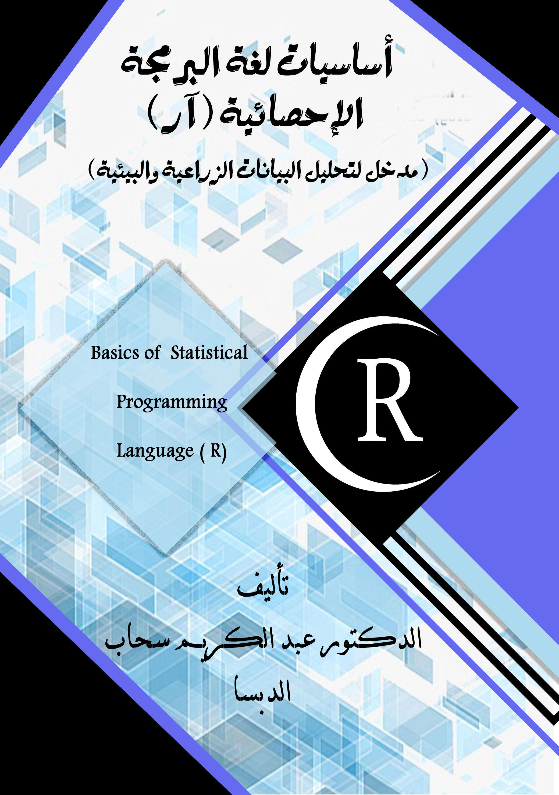

# 📖 أساسیات لغة البرمجة الإحصائیة (آر)
)

## 📌 عن الكتاب

**أساسیات لغة البرمجة الإحصائیة (آر)
(مدخل لتحلیل البیانات الز ا رعیة والبیئیة)**     إن أﺻدار ﻫذا اﻟﻛﺗﺎب )ﻛﺧطوة أوﻟﻰ( ﻧﺎﺗﺞ ﻋن اﻟﺣﺎﺟﺔ اﻟﻣﺎﺳﺔ ﻟﺳد اﻟﻔﺟوة اﻟﻣوﺟودة ﻓﻲ اﻟﻠﻐﺎت اﻹﺣﺻﺎﺋﯾﺔ ﻓﻲ اﻟﻣﻧﺎﻫﺞ اﻟﻌرﺑﯾﺔ.  ﻓﻣن اﻟﻣﻬم ﺟداً ﻋﻧد اﻟوﻟوج إﻟﻰ ﻋﻠم اﻹﺣﺻﺎء ﻣن أﺟل اﻟﺗﺣﺎﻟﯾل   اﻹﺣﺻﺎﺋﯾﺔ ﻟﻠﺗﺟﺎرب اﻟﻣﯾداﻧﯾﺔ أن ﯾﺗم ﻓﻬم ﻋﻣل اﻟﻣﻌﺎدﻻت اﻹﺣﺻﺎﺋﯾﺔ وﻛﯾﻔﯾﺔ ﻣﻌﺎﻟﺟﺔ اﻟﺑﯾﺎﻧﺎت ﻛﺧطوة أوﻟﻰ ﻟﻣﺧرﺟﺎت رﺻﯾﻧﺔ. إذ ﯾدرس ﻓﻲ أﻏﻠب اﻟﺟﺎﻣﻌﺎت واﻟﻣﻌﺎﻫد ﻋﻠم اﻹﺣﺻﺎء ﻛﺄﺣد اﻟطرق اﻟﻌﻠﻣﯾﺔ ﻟﺟﻣﻊ  اﻟﺑﯾﺎﻧﺎت وﺗﻧظﯾﻣﻬﺎ وﺗﺣﻠﯾﻠﻬﺎ ﻟﻠوﺻول إﻟﻰ ﻧﺗﺎﺋﺞ ﻣوﺛوﻗﺔ ﺗﺳﻬم ﻓﻲ دﻋم اﻟﻘ ار ارت اﻟﻣﺳﺗﻘﺑﻠﯾﺔ. وان اﺗﺳﺎع إﺳﺗﺧدام ﻋﻠم اﻹﺣﺻﺎء ﻧﺎﺗﺞ ﻋن اﻟﺗطو ارت اﻟﺳرﯾﻌﺔ ﻓﻲ اﻟﻌﻠوم اﻟﻣﺧﺗﻠﻔﺔ وﻛﻣﯾﺔ اﻟﺑﯾﺎﻧﺎت اﻟﻌﻣﻼﻗﺔ اﻟﺗﻲ ﻣن اﻟﻣﻣﻛن اﻟﺣﺻول ﻋﻠﯾﻬﺎ ﻓﻲ زﻣن وﺟﻬد ﻗﯾﺎﺳﯾﯾن. ﻫذا اﻹﺗﺳﺎع ﻛﺎن ﻻﺑد أن ﯾؤدي إﻟﻰ ﺗﺣﻔﯾز اﻟﻣﺧﺗﺻﯾن ﻋﻠﻰ إﻧﺷﺎء أو ﺗﺑﻧﻲ ﺑﻌض اﻷدوات اﻟﺗﻲ ﺗُﺳﻬم ﻓﻲ ﺗﺳﻬﯾل ﻋﻣﻠﯾﺔ اﻟﺗﻧظﯾم واﻟﺗﺣﻠﯾل وﻏﯾرﻫﺎ ﻟﻠﻧﺗﺎﺋﺞ. ﻋﻠﻰ أﺛر ذﻟك اﻧﺗﺷرت اﻟﺑ ارﻣﺞ اﻹﺣﺻﺎﺋﯾﺔ اﻟﻣﺧﺗﻠﻔﺔ, ﻓﻘد أﺻﺑﺣت اﻟﺑ ارﻣﺞ اﻹﺣﺻﺎﺋﯾﺔ أﻛﺛر ﺗداوﻻً ﺑل ﺗُدرس ﻓﻲ ﻣﺧﺗﻠف اﻟﻣﻌﺎﻫد واﻟﺟﺎﻣﻌﺎت اﻟﻣﻧﺗﺷرة وﻓﻲ ﺗطﺑﯾﻘﺎت اﻷﻋﻣﺎل اﻟﻬﺎﻣﺔ ، وﻫذا ﻣﺎ ﻧﻠﻣﺳﻪ واﺿﺣﺎ ﻓﻲ ﺗدرﯾس ﺑرﻧﺎﻣﺞ ﻣﻌﺎﻟﺞ اﻟﺟداول Excel واﻟﺑرﻧﺎﻣﺞ اﻹﺣﺻﺎﺋﻲ SPSS وﺑرﻧﺎﻣﺞ Matlab و Minitab وﺑرﻧﺎﻣﺞ SAS و S. 

- *ﺗُﻌد ﻟﻐﺔ ال R أﺣدى ﻟﻐﺎت اﻟﺑرﻣﺟﺔ ﻣﻔﺗوﺣﺔ اﻟﻣﺻدر وﻫذا ﯾﻌﻧﻲ أﻧﻪ ﯾﻣﻛن ﻷي ﺷﺧص اﻟﻌﻣل ﻣﻊ
ﻟﻐﺔ الR دون اﻟﺣﺎﺟﺔ إﻟﻰ ﺗرﺧﯾص أو رﺳوم. ﻋﻼوة ﻋﻠﻰ ذﻟك, ﯾﻣﻛﻧك اﻟﻣﺳﺎﻫﻣﺔ ﻓﻲ ﺗطوﯾر ﻟﻐﺔ الR ﻣن
ﺧﻼل ﺗﻌدﯾل اﻟﺣزم اﻟﻘدﯾﻣﺔ وﺗطوﯾر ﺣزم ﺟدﯾدة واﯾﺟﺎد ﺣل ﻟﺑﻌض اﻟﻣﺷﺎﻛل ﻓﻲ اﻟﺗﺧﺻﺻﺎت اﻟﻣﺧﺗﻠﻔﺔ.
*
- *ﺗوﻓر ﻟﻐﺔ ال R دﻋﻣﺎً ﻣﺛﺎﻟﯾﺎً ﻟﻠﺑﯾﺎﻧﺎت اﻟﺟدﻟﯾﺔ )ﺑﻣﻌﻧﻰ اﻟﺑﯾﺎﻧﺎت ﺷدﯾدة اﻟﻔوﺿوﯾﺔ,( ﻫذا اﻟدﻋم ﻣﺗﻣﺛل ﺑوﺟود ﺣزم ﻣﺛل ال dplyr و readr واﻟﺗﻲ ﺗﻌﻣل ﻋﻠﻰ ﺗﺣﺳﯾن اﻟﺑﯾﺎﻧﺎت اﻟﻔوﺿوﯾﺔ وﺗﺣوﯾﻠﻬﺎ إﻟﻰ ﺑﯾﺎﻧﺎت ﻧﻣوذﺟﯾﺔ ﻣﻘروءة ﺑﺷﻛل ﺟﯾد ﻣن ﻗﺑل اﻟﺑﺎﺣﺛﯾن واﻟطﻼب واﻟﻣﻬﺗﻣﯾن ﺑﻬذﻩ اﻟﺑﯾﺎﻧﺎت.*
- *ﻟدى ﻟﻐﺔ الR ﻣﺟﻣوﻋﺔ ﻛﺑﯾرة ﻣن اﻟﺣزم اﻟﻣﺗﻧوﻋﺔ. ﯾوﺟد أﻛﺛر ﻣن (10,000) ﺣزﻣﺔ ﻓﻲ ﻣﺳﺗودع)ﺷﺑﻛﺔ ارﺷﯾف ال آر اﻟﺷﺎﻣﻠﺔ( Network Archive R Comprehensive واﻟﺗﻲ ﺗُﻛﺗب إﺧﺗﺻﺎ ار ,CRAN ﻋﻠﻣﺎ أن ﻫذا اﻟﻌدد ﯾﺗ ازﯾد ﺑﺎﺳﺗﻣ ارر. ﻫذﻩ اﻟﺣزم ﻣﺗﻧوﻋﺔ ﻓﻲ طﺑﯾﻌﺔ ﻋﻣﻠﻬﺎ ﻓﻬﻲ ﻣﺗداﺧﻠﺔ ﺑﯾن اﻟﻌﻠوم اﻟﻣﺧﺗﻠﻔﺔ وأﯾﺿﺎً ﻣﺗﺧﺻﺻﺔ ﺑﻌض اﻟﻌﻠوم اﻻﺧرى. ﺗﺧﺗﻠف اﻟﺣزم ﻣن ﻧﺎﺣﯾﺔ اﻻﻗﺑﺎل ﻋﻠﯾﻬﺎ, ﻓﺑﻌض اﻟﺣزم ﺗﻛون ذات اﻗﺑﺎل اوﺳﻊ ﻣن ﻏﯾرﻫﺎ. ﯾﻌﺗﻣد اﻹﻗﺑﺎل إﻟﻰ أﻫﻣﯾﺔ اﻟﺣزﻣﺔ وﻣﺎ ﺗﺣﺗوﯾﻪ ﻣن دوال داﺧﻠﯾﺔ وﻛذﻟك إﻟﻰ ﻛﯾﻔﯾﺔ اﻟﺗﻌﺎﻣل ﻣﻊ اﻟﺑﯾﺎﻧﺎت وﻣﺧرﺟﺎﺗﻬﺎ.
اﻟﺷﻛل اﻵﺗﻲ ﯾوﺿﺢ أﻛﺛر اﻟﺣزم إﻗﺑﺎﻻ ﻣن ﻗﺑل اﻟﻣﺳﺗﺧدﻣﯾن ﺣﺗﻰ ﻋﺎم 2017 .[Ove]*

!(images/145.png)

هذا الكتاب موجه إلى:
- *الطلاب الجامعيين من الدراسات الاولية والعليا*
- *المهتمين في التطور البرمجي و الهواة*

---

## 📥 تحميل أو قراءة الكتاب

يمكنك قراءة أو تحميل الكتاب من هنا:

📄 **PDF:** [رابط ملف الـ PDF]  
📚 **eBook:** [رابط النسخة ePub / MOBI إن وجدت]  

---

## 🧠 ماذا ستتعلم

في هذا الكتاب ستتعرف على:
1. **الفصل 1 – *البداية مع ال R***  
   *وصف موجز لما يشمله هذا الفصل.*

2. **الفصل 2 – *بيئة ال R**  
   *وصف موجز لما يشمله هذا الفصل.*

3. **الفصل 3 – *حزم ال R***  
   *وصف موجز لما يشمله هذا الفصل.*

4. **الفصل 4 – *أساسيات ال R***  
   *وصف موجز لما يشمله هذا الفصل.*

5. **الفصل 5 – *المشغلات في ال R**  
   *وصف موجز لما يشمله هذا الفصل.*

6. **الفصل 6 – *قراءة البيانات ***  
   *وصف موجز لما يشمله هذا الفصل.*

7. **الفصل 7 – *رسومات أحصائية ***  
   *وصف موجز لما يشمله هذا الفصل.*

8. **الفصل 8 – *  عبارات التحكم**  
   *وصف موجز لما يشمله هذا الفصل.*

9. **الفصل 9 – *  الحلقات Loops***  
   *وصف موجز لما يشمله هذا الفصل.*
   

10. **الفصل 10 – *كتابة الدوال**  
   *وصف موجز لما يشمله هذا الفصل.*

11. **الفصل 11 – *التلاعب الجماعي  ***  
   *وصف موجز لما يشمله هذا الفصل.*

12. **الفصل 12 – *اعادة تشكيل البيانات  ***  
   *وصف موجز لما يشمله هذا الفصل.*

13. **الفصل 13 – *   التلاعب بالنصوص**  
   *وصف موجز لما يشمله هذا الفصل.*

14. **الفصل 14 – *  الحلقات Loops***  
   *وصف موجز لما يشمله هذا الفصل.

> .

---

## 📣 آراء ومراجعات

> “*أدخل اقتباسًا من رأي أحد القرّاء أو مراجع*”

⭐ *أضف أي تقييمات أو ردود فعل إيجابية.*

---

## 🛠 كيف تستخدم هذا المستودع

هذا المستودع يحتوي على:
- 📄 `book.pdf` — نسخة الكتاب بصيغة PDF  
- 🖼 `images/` — مجلد يحتوي على الغلاف والصور  
- 📄 `README.md` — هذه الصفحة

---

## 🤝 المساهمة

إذا كنت ترغب في:
- اقتراح تحسينات
- الإبلاغ عن أخطاء
- ترجمة الكتاب

…يمكنك فتح Issue أو إرسال Pull Request!

---
## ✍️ عن المؤلف

*# 🧑‍🔬 Dr. Abdulkareem Sahab Aldabsaa — د. عبد الكريم سحاب الدبّساء

**Dr. Abdulkareem Sahab Aldabsaa (د. ﻋﺑداﻟﻛرﯾم ﺳﺣﺎب اﻟدﺑﺳﺎ)** holds a **Ph.D. in Soil and Water Resources** from the College of Agriculture & Environment – **University of Western Australia**.  
His doctoral research focused on *soil water movement*, tracking water flow in soil layers, and identifying soil properties across different soil types.

## 🎓 Academic & Professional Background

- **Ph.D. in Soil and Water Resources** — University of Western Australia  
- **Master’s in Soil & Water Resources** — University of Tikrit, College of Agriculture  
- **Bachelor’s in General Plant Production** — University of Tikrit, College of Agriculture

 

---

## 🧪 Expertise & Key Techniques

Dr. Aldabsaa’s core expertise includes:

### 🔹 Soil & Water Movement  
- Soil physical and hydraulic property measurement  
- Monitoring and analyzing water movement in different soil textures  

### 🔹 Programming & Data Analysis  
- R language (advanced coding and algorithm modification)  
- Python for data processing and analysis  

### 🔹 Geophysical & Remote Sensing Tools  
- **Electronic Resistivity Tomography (ERT)**  
- **Electromagnetic Induction (EMI)**  
- Infrared and thermal imaging for soil characterization

---

## 📊 Courses & Training

- GIS Programming — University of Western Australia (01/2017–06/2017)  
- Environmental Modelling — University of Western Australia (07/2015–12/2015)  
- R Advanced Coding Course  
- Academic English Bridging Course (High Distinction)  
- Field and lab techniques for environmental and geospatial analysis  
- Training in modern farm management (JICA / CARDNE — Amman, Jordan)

---

## 🌍 International Participation & Conferences

Dr. Aldabsaa participated and presented in multiple international events:

- **European Geosciences Union (EGU) General Assembly 2017**  
  - Experimental Investigation of thermal and CT soil patterns  
  - Thermal imaging of hydrophobic soils and surfactant response

- **WA Soils Conference 2015**, Mandurah, Western Australia  
- **5th Scientific Conference — College of Agriculture, University of Tikrit**

---

## 📚 Publications & Research

Selected work includes:

- *Thermal imaging of a hydrophobic soil’s response to surfactant application*  
  — **Geoderma 368, 114309**  
- Submitted: *Experimental Investigation of 2D thermal and 3D CT in soil beads*  
- Various in‑prep manuscripts on soil water repellency and spatial soil properties

---

## 🏆 Achievements & Recognition

Dr. Aldabsaa has received numerous **certificates of appreciation**, awards, and honors throughout his academic career — notably:

✔ One of the **top seven doctoral theses awards** at the University of Western Australia  
✔ Multiple local and international recognitions for scientific contribution  
✔ Over 25 certificates of appreciation from ministries, universities, and professional bodies

---

## 📌 Summary Professional / ملخص الخبرة

• Soil physics, hydraulic, and thermodynamic property analysis — field & lab  
• Remote sensing and spatial water movement tracking using advanced algorithms  
• R and Python programming for soil data handling and interpretation  
• Practical use of ERT, EMI, and thermal imaging for soil research  

---

## 📬 تواصل معي

إذا قرأت الكتاب أحب أن أعرف رأيك!  
راسلني عبر البريد: **your.email@example.com**
